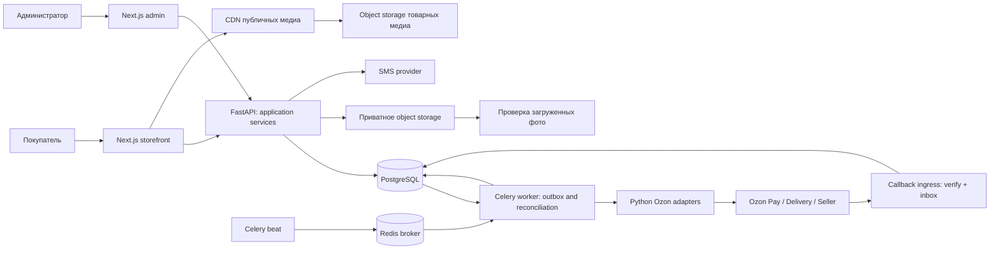

# Solution Architecture — Elton Decor

Дата: 2026-10-06. Статус: **предложение для подготовки MVP**, не утверждение разработки, не описание действующей системы. Бизнес-источник — BA интервью; статусы требований и решений фиксируются в [PRODUCT.md](PRODUCT.md), [BUSINESS_RULES.md](BUSINESS_RULES.md) и [DECISIONS.md](DECISIONS.md). Технические алгоритмы здесь требуют архитектурного review/согласования.

## 1. Границы решения

Один monorepo, один API, одна локальная модель заказа. Storefront и admin — два интерфейса этого API. PostgreSQL хранит локальные заказы, снимки цен, решения по возвратам и финансовый журнал. Провайдер является источником подтверждённых платежей и статусов исполнения. Сведения маркетплейса хранятся с `channel=ozon_marketplace`, покупки сайта — с `channel=site`: внешние продажи нельзя незаметно сделать заказами сайта.

Целевой MVP покрывает CAT-01–06 (каталог), ORD-01–05 (гостевая корзина/checkout), ACC-01–03 (SMS вход и кабинет), RET-01–03 (возврат с фото и решение с причиной отказа), ADM-01–08 (администрирование). Статусы каждого требования — в [PRODUCT.md](PRODUCT.md): Ozon checkout/отзывы условны, отдельный email/password admin и ряд механик предложены/открыты. Публичный каталог содержит согласованные категории, Hero и товары; регистрации перед покупкой нет. Избранное, OAuth, loyalty, блог и AI относятся к V2. Глубина истории цен, варианты и правила наборов требуют решения заказчика.

## 2. Компоненты и границы доверия

Redis — брокер задач, лимиты и краткоживущий cache. Потеря Redis не должна уничтожать заказ или факт платежа: outbox и inbox остаются в PG, диспетчер повторно ставит задачи. Объектное хранилище — интерфейс; Supabase Storage лишь кандидат. Frontend hosting, API hosting, SMS и инфраструктура ещё не выбраны. Облачные ресурсы этим документом не создаются.

## 3. Предложенная структура

| Путь | Назначение | Владелец данных/зависимость |
|---|---|---|
| `apps/storefront` | Next.js/TypeScript каталог, checkout, кабинет | Обращается только к API; без прямого PG/Seller API |
| `apps/admin` | Next.js/TypeScript защищённый backoffice | Без секретов провайдера в браузере |
| `apps/api` | FastAPI/Pydantic, use cases, authorization, HTTP; Celery worker/beat entrypoints | Единственный публичный бизнес API; HTTP, worker и beat отдельные runtime процессы с общими Python services |
| `packages/ui` | Общие TS компоненты и дизайн-токены | npm/workspace package |
| `packages/database` | Python SQLAlchemy models, Alembic | **Единственный владелец схемы и миграций** |
| `packages/ozon` | Python adapters и normalized DTO | Разные клиенты Seller и Pay/Delivery |
| `packages/analytics` | Схемы событий и чистые Python расчёты | Без собственных миграций |
| `docs` | Согласованные требования/решения/контракты | Источник истины перед реализацией |

Python directories используют `pyproject.toml` и выбранный Python workspace manager; это не npm packages. Конкретный менеджер и lockfile выбираются при bootstrapping. TS может использовать один npm-compatible workspace; решение открыто. Генерация TS types из OpenAPI предпочтительна ручному дублированию Python models. Не вводить Prisma или отдельную систему миграций Supabase. Секреты и production данные не включаются в репозиторий.

## 4. Бизнес-модули внутри API

Модульный монолит позволяет выполнять локальную транзакцию без распределённой сделки. `catalog` управляет товарами, категориями, ценами сайта и версиями наборов; `checkout` рассчитывает quote и создаёт заказ; `orders` хранит снимки; `payments` и `refunds` ведут отдельные состояния; `returns` хранит претензию и административное решение; `identity` обеспечивает SMS/сессии; `integration` ведёт outbox, inbox и сверку; `analytics` читает согласованные события.

API и worker используют одни application services и state transition validators. HTTP handler не содержит повторную альтернативную бизнес-логику. Внешние side effects выполняются после commit через outbox. Таймаут внешней команды означает неизвестный исход, а не доказанный отказ.

| Область | Предложенная реализация |
|---|---|
| Cache | Публичный каталог — CDN/Next cache и Redis read cache, invalidation при admin changes через outbox; auth/cart/order/admin — `private, no-store`. Цена checkout читается/проверяется в PG, не из CDN. Stock DTO имеет age/semantics даже в cache; TTL определяется Q-05 |
| Media | Товарные фото/видео — object storage S3-compatible interface + CDN, derivatives/optimization по выбранному hosting. Фото возврата — отдельная private область, quarantine/scan, signed URL после authorization; CDN public для них запрещён |
| Background | PG outbox dispatcher/reclaim, inbox processing, reconciliation, stock refresh, fulfilment poll, разрешённые reviews sync, upload scan. Performance reports — async submit/poll/download jobs лишь после отдельного analytics/entitlement решения; beat schedules по контракту, не в HTTP request |
| Events | Envelope `event_id, schema_version, name, occurred_at, channel, anonymous_session_ref?, product_id?, cart_id?, order_id?, sanitized_utm?`; без телефона/адреса/токенов/фото. Схема событий и consent/retention предложены, Q-10 открыто. `purchase` создаётся сервером только по verified payment и dedupe fact, не browser return URL |

Публичные product DTO не содержат себестоимость. Каталог/подборки/«С этим сочетается», характеристики и SEO требуют административной модели контента; depth и publish workflow согласуются по Q-09. Ручная себестоимость ADM-05 хранится раздельно от site price и доступна только admin/разрешённой аналитике.

## 5. Процесс покупки

1. Гостевая корзина привязана к случайной серверной сессии. API проверяет количество и актуальные цены. Корзина не обещает наличие.
2. Quote фиксирует состав, цену, распределение скидки, доставку и срок действия. Доставка и допустимый порядок оплаты/создания внешнего заказа зависят от проверенного контракта Ozon.
3. В транзакции checkout API блокирует нужные строки, проверяет quote/version, создаёт order + price/component snapshots + локальные reservations + operation + outbox. Commit происходит до обращения к провайдеру.
4. Worker исполняет операцию с устойчивым idempotency key. Если ответ потерян, сверяет результат по документированному механизму. Повторное списание запрещено.
5. UI получает `processing`, затем session/redirect либо уточнённую ошибку. Return URL сам по себе не подтверждает оплату. Callback сохраняется после проверки; worker проверяет объект у провайдера и изменяет отдельные state machines.
6. Согласование платежа и исполнения — saga с компенсацией. Если оплата прошла, а доставку создать не удалось, заказ получает `attention_required`, запускается сверка/согласованная компенсация. Автоматический возврат и его порядок должны быть подтверждены контрактом.

**Gate:** шаги 3–6 — локальный архитектурный проект. Реальный порядок вызовов не утверждён до provider spike; недопустимо придумать Seller endpoint создания FBO заказа со своего сайта.

## 6. Состояния и инварианты

Точные схемы хранения — [DATABASE.md](DATABASE.md), публичные DTO — [API.md](API.md), provider gates — [OZON_INTEGRATION.md](OZON_INTEGRATION.md).

| Агрегат | Источник переходов | Инвариант |
|---|---|---|
| Order lifecycle | Локальные checkout/cancel use cases + подтверждённый provider result | `placed`, `cancel_requested`, `cancelled`, `completed`; проблема сверки отдельно `attention_required` |
| Fulfillment | Проверенный provider callback/poll | `not_submitted`, `submission_pending`, `accepted`, `packing`, `shipped`, `ready_for_pickup`, `delivered`, `cancelled`, `unknown`; частичные отправления хранятся отдельно |
| Payment attempt | Pay response + verified callback/poll | `created`, `pending`, `requires_action`, `succeeded`, `failed`, `cancelled`, `unknown`; один order может иметь последовательные attempts |
| Return request | Покупатель и авторизованное решение admin | `requested`, `under_review`, `approved`, `rejected`, `closed`; отказ требует причины |
| Refund operation | Локальная команда + проверенный Pay result | `requested`, `pending`, `succeeded`, `failed`, `unknown`; сумма успешных и активных возвратов не превышает captured amount |

`unknown` и `attention_required` не отображаются как «успешно». `succeeded` платежа не меняется на `failed` при позднем старом событии. Возврат денег не означает автоматически возврат товара/освобождение FBO stock. UI выводит независимые статусы оплаты, исполнения и возврата. Полный финансовый возврат определяется суммой refund, а не отдельным фиктивным переходом payment в `refunded`.

Администратор не редактирует fulfillment state вручную. Он может видеть проблему сверки и инициировать повторную проверку, решение по возврату или запрос отмены в рамках контракта. Финансовая коррекция — отдельная аудируемая запись; нельзя переписать исходный snapshot или provider fact.

## 7. Наличие и наборы

Наличие Ozon — наблюдение с `observed_at`, моделью FBO/FBS/rFBS, warehouse и определением полей. Локальная reservation координирует одновременные checkout сайта, **не резервирует общий склад Ozon**. TTL и политика отключения checkout при устаревших данных определяются по spike и ожидаемому времени оплаты.

Для общей FBO модели источник provider `available` может уже учитывать provider reservations. Вычитать их повторно нельзя. Локальная pending reservation учитывается консервативно лишь до подтверждённого отражения в provider snapshot по установленному watermark. Если корреляции нет, обещать точное real-time наличие нельзя; финальное подтверждение требуется при создании внешнего заказа.

Bundle хранит versioned bill of materials. Quote фиксирует компоненты и цены. Резервирование блокирует компоненты в стабильном порядке SKU и учитывает повторяющиеся SKU. FBO принимает компоненты/наборы только если их модель идентификации и комплектации подтверждена. Частичный возврат компонента и распределение стоимости описаны в DATABASE; клиентский интерфейс возврата набора требует бизнес-решения.

## 8. Безопасность и эксплуатация

- Предложение для одного admin account: email/password hash (Argon2id), server session с rotation/revocation, HttpOnly Secure SameSite cookie и CSRF защита mutations. Password bootstrap через секрет/локальный безопасный ввод, без пароля в коде. Механизм требует решения ADM-01/Q-06; текущий дизайн не заменяет его OAuth/SMS.
- SMS challenge хранит hash кода, expiry, attempt counter; лимиты по телефону/IP/device, исключение enumeration. Сессии покупателя и admin изолированы. Номер телефона не публичный order access token.
- Guest order доступен по отдельной случайной capability с hash в PG; неугадываемый UUID заказа не является достаточной авторизацией. Привязка guest заказа к кабинету — только после доказательства владения, правило согласовать.
- PII в orders ограничена необходимым, адрес профиля один; order address — отдельный исторический snapshot. Логи редактируют телефоны, адреса, токены, payment payload и фото.
- Фото возврата приватны; MIME/signature/size validation, quarantine/scan до показа, короткие signed URLs только после authorization, без публичного bucket.
- Webhook signing/mTLS/allowlist выбираются по реальному контракту; IP allowlist недостаточен как единственная аутентификация. Replay/dedupe, raw-body verification до parsing, ограничение body size.
- Trace IDs связывают request, order, operation, outbox и external IDs. Метрики: lag outbox, inbox failures, stuck unknown, stock age, mismatches; значения SLA/alert thresholds не выдуманы и требуют согласования.
- Backup PG + проверка восстановления, graceful migrations, приватное storage, мониторинг worker/beat. Deployment topology, retention, персональные данные и необходимые тексты для торговли проверяются отдельно до запуска.

## 9. Reuse и V2

`elton-dashboard-ai` на ревизии `cbe64fd3994c84971f5be617ace0bd662a4a79f7` — Python прототип экономики маркетплейса. Переиспользуются идеи нормализации Seller data и формул после сверки; отсутствуют готовые storefront/admin/API/DB. Нельзя переносить hardcoded COGS, SKU groups, целевую маржу, float money, кеш токена без expiry и обработку ошибок как `{}` в core. Формулы становятся чистыми функциями `packages/analytics` с проверенными fixtures и явной моделью комиссий/себестоимости.

Gemini — возможный будущий аналитический агент V2: читает минимизированные/агрегированные данные через scoped tools, рекомендации проходят человека. Он не является источником статуса платежа/заказа, не имеет прямого PG write и не меняет цену/возврат автономно. В MVP LLM runtime и credentials не нужны.

## 10. Gates до разработки и запуска

| Gate | Проверяемый результат | Блокируемая часть |
|---|---|---|
| ARCH-G1 Provider entitlement/contract | Доступ конкретного seller, docs version, sandbox, допустимые модели | Реальный checkout Pay + Delivery |
| ARCH-G2 End-to-end sandbox | Quote → внешняя операция → оплата → исполнение → отмена/частичный refund, callbacks, lost response | Автоматизация финансов/доставки |
| ARCH-G3 Stock/bundle semantics | Что означает available, freshness, reservation reflection, component identities | Обещание наличия и продажа bundles |
| ARCH-G4 Business decisions | Bundle return policy, guest claiming, цена/варианты/история, сроки reservations | Финальная UX/схема и acceptance |
| ARCH-G5 Operational readiness | Secret management, backup restore, RBAC/IDOR/CSRF, upload scan, reconciliation drill | Production запуск |

До закрытия ARCH-G1–G3 можно готовить каталог, admin prototype и внутренний контракт; публичные покупки с неподтверждённой интеграцией запускать нельзя. Открытые решения Q-01–11 фиксируются в DECISIONS, не принимаются неявно этим документом. ARCH-gates детализируют продуктовые gates MVP_SCOPE и не заменяют QA/release gates.
