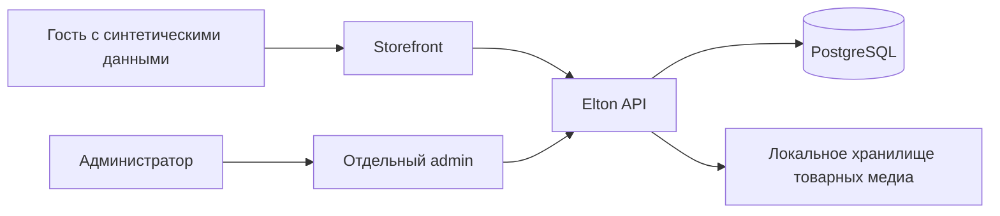
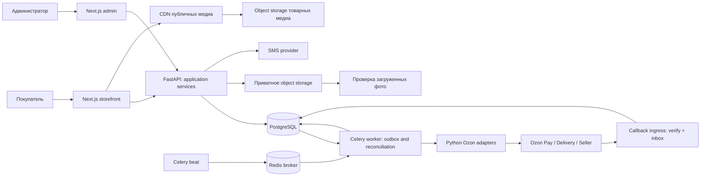

# Solution Architecture — Elton Decor

База: 2026-10-06; уточнение завершения: 2026-10-07. BA-SCOPE-01/BR-27 и локальный ADM-01 по BA-AUTH-01/ADR-014 утверждены заказчиком. Storefront/admin/API и Alembic migrations 0001…0003 существуют на HEAD `0c8697a5102e6b9ff56e95889f319d8906f09d81`; их наличие не означает пройденную PostgreSQL/browser приемку. Изменения технического контракта проходят Backend review; production approval отсутствует.

## Активное уточнение завершения

[План 2026-10-07-stage1-closure](superpowers/plans/2026-10-07-stage1-closure.md) задаёт active contract: PostgreSQL demo/test isolation, one-owner admin login/session/logout, защищённый CLI bootstrap/reset, raster decode/re-encode и actual browser→proxy→API→PG проверки. ADM-01 pending gate прежнего проекта superseded ADR-014 для локального этапа 1.

Admin email нормализуется, пароль хешируется Argon2id, токены сессии случайные и хранятся только как hash. Ротация на login, отзыв на logout/reset, session-bound CSRF и exact admin Origin защищают API. Admin и guest scopes/cookies разделены; browser auth storage отсутствует. Каталог admin требует `catalog.read`/`catalog.write`, заявки — `drafts.read`; права назначаются owner при atomic bootstrap. HTTP signup/recovery endpoints отсутствуют.

Media pipeline: streamed quarantine → signature/MIME/limits → trusted full raster decode → EXIF transpose → fresh RGB/RGBA derivative re-encode без metadata → durable server UUID storage key → atomic clean DB/audit. Сырые загрузки не публикуются. Unsupported/corrupt/animated/bomb/active content отклоняется; видео остаётся disabled до отдельной проверенной container/codec pipeline.

Read-only Ozon — отдельный необязательный server CLI/adapter, разрешённый текущей задачей после актуальной docs/account проверки. Seller catalog/FBO observations и Performance marketplace facts хранятся/показываются отдельно от site prices/drafts; ошибки не заменяются нулём. Guest/cart/draft/admin auth не делают внешних вызовов. Отзывы не публикуются до Q-08, real_checkout/payment/delivery/stock_reservation/sms/customer_account/returns/refunds/reviews остаются false. Список read endpoints и live verification evidence фиксируются отдельно; контракт не создаёт Seller FBO заказ сайта.

## 1. Основание и трассировка

Прочитаны AGENTS.md, профиль docs/agents/ARCHITECT.md, PRODUCT, MVP_SCOPE, BUSINESS_RULES, ARCHITECTURE, DATABASE, API, OZON_INTEGRATION, DECISIONS, SECURITY, DEPLOYMENT, QA, BACKLOG. Remote база: `142c0a1186a48994b26048c06182c0ea1757049d`; BA FREEZE от 2026-10-06 с BA-SCOPE-01 — вход этой задачи. В локальной папке нет .git; document PR branch: `docs/stage1-ozon-onboarding`; итоговый PR commit зафиксирует обновления.

Основа: CAT-01…05, ORD-01…03, ADM-01/03/05/06; ограничения CAT-06, ORD-04/05, BR-01…09/12/14/17/18/24/25/27; S1-01…S1-06. BR-15 сохраняет предложенный статус. Область Architect: ARCHITECTURE/DATABASE/API/OZON_INTEGRATION/DECISIONS и [план основы](superpowers/plans/2026-10-06-stage1-foundation.md).

## 2. Активная основа этапа 1

Один monorepo, один Elton API, PostgreSQL. Два приложения Next.js/TypeScript: storefront и отдельный admin; FastAPI/Pydantic — рекомендованный Python API, SQLAlchemy/Alembic — единственный владелец схемы в packages/database. Рекомендация workspace tooling: pnpm для TypeScript, uv для Python; решение проходит bootstrap review. Версии/tooling выбираются при bootstrap по поддерживаемым совместимым stable releases и фиксируются lockfiles; точных непроверенных версий здесь нет.

Bootstrap требует storefront/admin/API/PG и локальные товарные медиа. Redis/Celery, SMS, customer profile, Pay/Delivery/FBO, provider credentials, outbox/inbox и ledger не являются зависимостями. Server capabilities: real_checkout/payment/delivery/stock_reservation/sms/customer_account/returns/refunds/reviews = false. Прямой вызов недоступной операции отклоняется до adapter/network call, без simulated success.

| Путь | Ответственность / владелец |
| --- | --- |
| apps/storefront | Frontend: hero, каталог/PDP, server cart, форма синтетических контактов/адреса, результат |
| apps/admin | Frontend: защищённый UI каталога/медиа/цен/BOM/списка заявок |
| apps/api | Backend/Ozon: HTTP, catalog/cart/draft services, server authorization, capabilities; core rules |
| packages/database | Backend с Architect review: Python models/repositories/Alembic, единственный владелец PG |
| packages/ui | Frontend: общие TS компоненты/токены |
| packages/api-client | Frontend после freeze API: сгенерированные OpenAPI TS types и wrapper |
| packages/ozon | Будущие Python adapters этапа 2; не обязательный runtime основы |
| packages/analytics | Будущая аналитика; локальная заявка не создаёт purchase/выручку |
| docs | Контракт перед реализацией; DB/API изменения в том же согласованном PR |

Frontend читает только API, не PG/Ozon. Public catalog сначала no-store, без обязательного cache worker; cart/draft/admin — private/no-store. Наличие unknown, без числа FBO. Supabase PG/Storage и Vercel — hosting candidates; Supabase Auth/Shopify order authority не вводятся.

## 3. Первый вертикальный сценарий

1. Случайная persistent HttpOnly guest cookie; hash/expiry в PG. Это гостевая сессия без SMS/аккаунта. Предлагаемый demo срок 7 дней, quote 15 минут — технические параметры испытаний, не утверждённая retention/recovery политика.
2. Cart принадлежит guest session в PG. PUT количества/DELETE меняют version под lock; If-Match предотвращает потерю правки. Цена всегда серверная. Cookie переживает закрытие браузера в своём сроке; её удаление теряет proof, телефон не восстанавливает доступ.
3. POST draft-quotes фиксирует cart_version и product/price/BOM versions со снимком. Товарная сумма в minor units. delivery.state=not_connected, delivery.amount=null, payable_total=null: goods_total не полная цена покупки. Quote не резервирует локальный/FBO запас.
4. UI показывает состав/товарную сумму и отключение оплаты/доставки. Контакты/адрес — отдельный предложенный demo DTO, не provider contract и не ACC-02 profile. Все demo данные синтетические; реальные данные требуют отдельного допуска.
5. POST checkout-drafts с Idempotency-Key и quote ID в одной PG transaction проверяет owner, quote/cart/catalog versions/expiry; сохраняет immutable contact/address/line/component snapshots + state=saved + idempotency result. Нет operation/outbox/payment/fulfillment/reservation/ledger. Cart остаётся редактируемым.
6. Lost response: тот же key/body возвращает сохранённый draft. Replay проверяет действующую session/owner до выдачи и выполняется до expiry/consumed guard quote. Тот же key с другим body конфликтует; новый key с consumed quote → QUOTE_USED. Изменённая цена/BOM до commit требует нового quote и явного подтверждения, без autosubmit.
7. GET checkout-drafts/{id} требует guest owner; admin использует отдельный admin endpoint. Чужой/неизвестный ID дают одинаковый 404. UUID/телефон/query token/localStorage не доказательство доступа.

Quote: valid → consumed только в commit draft; expired — вычисленная недоступность по expires_at. Draft: только saved; editing — форма/cart, не business state. Отмена/оплата/исполнение не существуют. Этап 2 не продвигает saved автоматически: будущая согласованная command после свежего quote, наличия/доставки и нового подтверждения пользователя может создать новый commercial order со ссылкой на draft. Этот контракт сейчас не активен.

## 4. Каталог, комплекты и minimal admin

Согласованные категории CAT-01, title/description/SKU/type, характеристики/SEO, статические подборки, группы вариантов CAT-05 и versioned site price. CAT-03/Q-09 требуют review; demo query title/SKU, category, price sort — пробный внутренний контракт, не утверждение финального UX. Рекомендации «С этим сочетается» не используют relation-группу вариантов.

Bundle имеет собственную site price и versioned BOM. Предложенная BR-12 валидация: непустые existing single SKU, positive integer qty, одинаковые SKU суммируются, nested bundle запрещён. Draft замораживает SKU/title/qty/base site price компонентов. Base prices не net allocations/refund shares: BR-15/ADR-011 не утверждены. goods_total = сумма top-level lines, компоненты повторно не прибавляются. Unknown FBO не препятствует сохранению демонстрационного состава.

Admin permissions/scope isolation проверяет сервер. ADM-01 email/password/Argon2id/server session согласован для локального этапа 1 по BA-AUTH-01/ADR-014. Открытый admin не закрывает S1-05. Защищённый CLI bootstrap/reset и отдельная cookie/session/CSRF реализуются по SECURITY/API и проходят implementation review.

Media — admin file upload без fetch URL (SSRF). Локальный storage вне web-root, server UUID key; quarantine до проверки реального типа/декодирования/размера/metadata. HTML/SVG/scripts и неподтверждённое видео отклоняются. Только verified public товарные derivatives доступны storefront. API demo limits — технические рекомендации, не объём реального медиакомплекта. Private return media — этап 2. Admin меняет товар/site price/BOM, видит saved drafts; ручной paid/delivered/FBO отсутствует.

## 5. Review и готовность основы

[DATABASE.md](DATABASE.md) задаёт три additive migrations, [API.md](API.md) — DTO/ошибки/guards. Backend review: atomic idempotency+snapshot, immutable BOM/деньги, нормализация request hash, versions/ownership. QA использует настоящую PG; browser persistence не доказывает durability. Последовательные owner tasks — в плане; shared contracts меняет Architect с Backend review.

Открыто: Q-09 — final catalog content; TTL/contact DTO — technical demo review; hosting/region/PII/retention — live preview/data/release; BR-15 — net allocation/refund, не BOM snapshot. ADM-01 согласован локально; реализация и проверки обязательны для приёмки admin. Ozon gates блокируют этап 2, не bootstrap. S1-01…06 закрываются работающим demo/отчётом, не документами. Production/необратимые миграции требуют DEPLOYMENT допуска.

## Сохранённый target этапа 2

Разделы ниже — **будущая коммерческая архитектура**, не обязательные сервисы/DDL/API основы. BA-SCOPE-01 supersedes прежний порядок полного checkout до витрины; исходный scope остаётся после gates.

## 2. Компоненты и границы доверия

Redis — брокер задач, лимиты и краткоживущий cache. Потеря Redis не должна уничтожать заказ или факт платежа: outbox и inbox остаются в PG, диспетчер повторно ставит задачи. Объектное хранилище — интерфейс; Supabase Storage лишь кандидат. Frontend hosting, API hosting, SMS и инфраструктура ещё не выбраны. Облачные ресурсы этим документом не создаются.

## 3. Предложенная структура

| Путь | Назначение | Владелец данных/зависимость |
|---|---|---|
| `apps/storefront` | Next.js/TypeScript каталог, checkout, кабинет | Обращается только к API; без прямого PG/Seller API |
| `apps/admin` | Next.js/TypeScript защищённый backoffice | Без секретов провайдера в браузере |
| `apps/api` | FastAPI/Pydantic, use cases, authorization, HTTP; Celery worker/beat entrypoints | Единственный публичный бизнес API; HTTP, worker и beat отдельные runtime процессы с общими Python services |
| `packages/ui` | Общие TS компоненты и дизайн-токены | npm/workspace package |
| `packages/database` | Python SQLAlchemy models, Alembic | **Единственный владелец схемы и миграций** |
| `packages/ozon` | Python adapters и normalized DTO | Разные клиенты Seller и Pay/Delivery |
| `packages/analytics` | Схемы событий и чистые Python расчёты | Без собственных миграций |
| `docs` | Согласованные требования/решения/контракты | Источник истины перед реализацией |

Python directories используют `pyproject.toml` и выбранный Python workspace manager; это не npm packages. Конкретный менеджер и lockfile выбираются при bootstrapping. TS может использовать один npm-compatible workspace; решение открыто. Генерация TS types из OpenAPI предпочтительна ручному дублированию Python models. Не вводить Prisma или отдельную систему миграций Supabase. Секреты и production данные не включаются в репозиторий.

## 4. Бизнес-модули внутри API

Модульный монолит позволяет выполнять локальную транзакцию без распределённой сделки. `catalog` управляет товарами, категориями, ценами сайта и версиями наборов; `checkout` рассчитывает quote и создаёт заказ; `orders` хранит снимки; `payments` и `refunds` ведут отдельные состояния; `returns` хранит претензию и административное решение; `identity` обеспечивает SMS/сессии; `integration` ведёт outbox, inbox и сверку; `analytics` читает согласованные события.

API и worker используют одни application services и state transition validators. HTTP handler не содержит повторную альтернативную бизнес-логику. Внешние side effects выполняются после commit через outbox. Таймаут внешней команды означает неизвестный исход, а не доказанный отказ.

| Область | Предложенная реализация |
|---|---|
| Cache | Публичный каталог — CDN/Next cache и Redis read cache, invalidation при admin changes через outbox; auth/cart/order/admin — `private, no-store`. Цена checkout читается/проверяется в PG, не из CDN. Stock DTO имеет age/semantics даже в cache; TTL определяется Q-05 |
| Media | Товарные фото/видео — object storage S3-compatible interface + CDN, derivatives/optimization по выбранному hosting. Фото возврата — отдельная private область, quarantine/scan, signed URL после authorization; CDN public для них запрещён |
| Background | PG outbox dispatcher/reclaim, inbox processing, reconciliation, stock refresh, fulfilment poll, разрешённые reviews sync, upload scan. Performance reports — async submit/poll/download jobs лишь после отдельного analytics/entitlement решения; beat schedules по контракту, не в HTTP request |
| Events | Envelope `event_id, schema_version, name, occurred_at, channel, anonymous_session_ref?, product_id?, cart_id?, order_id?, sanitized_utm?`; без телефона/адреса/токенов/фото. Схема событий и consent/retention предложены, Q-10 открыто. `purchase` создаётся сервером только по verified payment и dedupe fact, не browser return URL |

Публичные product DTO не содержат себестоимость. Каталог/подборки/группы вариантов, характеристики и SEO требуют административной модели контента; depth и publish workflow согласуются по Q-09. Ручная себестоимость ADM-05 хранится раздельно от site price и доступна только admin/разрешённой аналитике.

## 5. Процесс покупки

1. Гостевая корзина привязана к случайной серверной сессии. API проверяет количество и актуальные цены. Корзина не обещает наличие.
2. После утверждения BR-15 коммерческий quote фиксирует состав, цену, согласованное распределение скидки, подтверждённую доставку и срок действия. Доставка и допустимый порядок оплаты/создания внешнего заказа зависят от проверенного контракта Ozon.
3. В транзакции checkout API блокирует нужные строки, проверяет quote/version, создаёт order + price/component snapshots + локальные reservations + operation + outbox. Commit происходит до обращения к провайдеру.
4. Worker исполняет операцию с устойчивым idempotency key. Если ответ потерян, сверяет результат по документированному механизму. Повторное списание запрещено.
5. UI получает `processing`, затем session/redirect либо уточнённую ошибку. Return URL сам по себе не подтверждает оплату. Callback сохраняется после проверки; worker проверяет объект у провайдера и изменяет отдельные state machines.
6. Согласование платежа и исполнения — saga с компенсацией. Если оплата прошла, а доставку создать не удалось, заказ получает `attention_required`, запускается сверка/согласованная компенсация. Автоматический возврат и его порядок должны быть подтверждены контрактом.

**Gate:** шаги 3–6 — локальный архитектурный проект. Реальный порядок вызовов не утверждён до provider spike; недопустимо придумать Seller endpoint создания FBO заказа со своего сайта.

## 6. Состояния и инварианты

Точные схемы хранения — [DATABASE.md](DATABASE.md), публичные DTO — [API.md](API.md), provider gates — [OZON_INTEGRATION.md](OZON_INTEGRATION.md).

| Агрегат | Источник переходов | Инвариант |
|---|---|---|
| Order lifecycle | Локальные checkout/cancel use cases + подтверждённый provider result | `placed`, `cancel_requested`, `cancelled`, `completed`; проблема сверки отдельно `attention_required` |
| Fulfillment | Проверенный provider callback/poll | `not_submitted`, `submission_pending`, `accepted`, `packing`, `shipped`, `ready_for_pickup`, `delivered`, `cancelled`, `unknown`; частичные отправления хранятся отдельно |
| Payment attempt | Pay response + verified callback/poll | `created`, `pending`, `requires_action`, `succeeded`, `failed`, `cancelled`, `unknown`; один order может иметь последовательные attempts |
| Return request | Покупатель и авторизованное решение admin | `requested`, `under_review`, `approved`, `rejected`, `closed`; отказ требует причины |
| Refund operation | Локальная команда + проверенный Pay result | `requested`, `pending`, `succeeded`, `failed`, `unknown`; сумма успешных и активных возвратов не превышает captured amount |

`unknown` и `attention_required` не отображаются как «успешно». `succeeded` платежа не меняется на `failed` при позднем старом событии. Возврат денег не означает автоматически возврат товара/освобождение FBO stock. UI выводит независимые статусы оплаты, исполнения и возврата. Полный финансовый возврат определяется суммой refund, а не отдельным фиктивным переходом payment в `refunded`.

Администратор не редактирует fulfillment state вручную. Он может видеть проблему сверки и инициировать повторную проверку, решение по возврату или запрос отмены в рамках контракта. Финансовая коррекция — отдельная аудируемая запись; нельзя переписать исходный snapshot или provider fact.

## 7. Наличие и наборы

Наличие Ozon — наблюдение с `observed_at`, моделью FBO/FBS/rFBS, warehouse и определением полей. Локальная reservation координирует одновременные checkout сайта, **не резервирует общий склад Ozon**. TTL и политика отключения checkout при устаревших данных определяются по spike и ожидаемому времени оплаты.

Для общей FBO модели источник provider `available` может уже учитывать provider reservations. Вычитать их повторно нельзя. Локальная pending reservation учитывается консервативно лишь до подтверждённого отражения в provider snapshot по установленному watermark. Если корреляции нет, обещать точное real-time наличие нельзя; финальное подтверждение требуется при создании внешнего заказа.

Bundle хранит versioned bill of materials. Quote фиксирует компоненты и цены. Резервирование блокирует компоненты в стабильном порядке SKU и учитывает повторяющиеся SKU. FBO принимает компоненты/наборы только если их модель идентификации и комплектации подтверждена. Частичный возврат компонента и распределение стоимости описаны в DATABASE; клиентский интерфейс возврата набора требует бизнес-решения.

## 8. Безопасность и эксплуатация

- Предложение для одного admin account: email/password hash (Argon2id), server session с rotation/revocation, HttpOnly Secure SameSite cookie и CSRF защита mutations. Password bootstrap через секрет/локальный безопасный ввод, без пароля в коде. Механизм требует решения ADM-01/Q-06; текущий дизайн не заменяет его OAuth/SMS.
- SMS challenge хранит hash кода, expiry, attempt counter; лимиты по телефону/IP/device, исключение enumeration. Сессии покупателя и admin изолированы. Номер телефона не публичный order access token.
- Guest order доступен по отдельной случайной capability с hash в PG; неугадываемый UUID заказа не является достаточной авторизацией. Привязка guest заказа к кабинету — только после доказательства владения, правило согласовать.
- PII в orders ограничена необходимым, адрес профиля один; order address — отдельный исторический snapshot. Логи редактируют телефоны, адреса, токены, payment payload и фото.
- Фото возврата приватны; MIME/signature/size validation, quarantine/scan до показа, короткие signed URLs только после authorization, без публичного bucket.
- Webhook signing/mTLS/allowlist выбираются по реальному контракту; IP allowlist недостаточен как единственная аутентификация. Replay/dedupe, raw-body verification до parsing, ограничение body size.
- Trace IDs связывают request, order, operation, outbox и external IDs. Метрики: lag outbox, inbox failures, stuck unknown, stock age, mismatches; значения SLA/alert thresholds не выдуманы и требуют согласования.
- Backup PG + проверка восстановления, graceful migrations, приватное storage, мониторинг worker/beat. Deployment topology, retention, персональные данные и необходимые тексты для торговли проверяются отдельно до запуска.

## 9. Reuse и V2

`elton-dashboard-ai` на ревизии `cbe64fd3994c84971f5be617ace0bd662a4a79f7` — Python прототип экономики маркетплейса. Переиспользуются идеи нормализации Seller data и формул после сверки; отсутствуют готовые storefront/admin/API/DB. Нельзя переносить hardcoded COGS, SKU groups, целевую маржу, float money, кеш токена без expiry и обработку ошибок как `{}` в core. Формулы становятся чистыми функциями `packages/analytics` с проверенными fixtures и явной моделью комиссий/себестоимости.

Gemini — возможный будущий аналитический агент V2: читает минимизированные/агрегированные данные через scoped tools, рекомендации проходят человека. Он не является источником статуса платежа/заказа, не имеет прямого PG write и не меняет цену/возврат автономно. В MVP LLM runtime и credentials не нужны.

## 10. Gates до коммерческой разработки и запуска этапа 2

| Gate | Проверяемый результат | Блокируемая часть |
|---|---|---|
| ARCH-G1 Provider entitlement/contract | Доступ конкретного seller, docs version, sandbox, допустимые модели | Реальный checkout Pay + Delivery |
| ARCH-G2 End-to-end sandbox | Quote → внешняя операция → оплата → исполнение → отмена/частичный refund, callbacks, lost response | Автоматизация финансов/доставки |
| ARCH-G3 Stock/bundle semantics | Что означает available, freshness, reservation reflection, component identities | Обещание наличия и продажа bundles |
| ARCH-G4 Business decisions | Bundle return policy, guest claiming, цена/варианты/история, сроки reservations | Финальная UX/схема и acceptance |
| ARCH-G5 Operational readiness | Secret management, backup restore, RBAC/IDOR/CSRF, upload scan, reconciliation drill | Production запуск |

До закрытия ARCH-G1–G3 выполняется локальная основа этапа 1; публичные покупки с неподтверждённой интеграцией запускать нельзя. Открытые решения Q-01–11 фиксируются в DECISIONS, не принимаются неявно этим документом. ARCH-gates детализируют продуктовые gates MVP_SCOPE и не заменяют QA/release gates.
