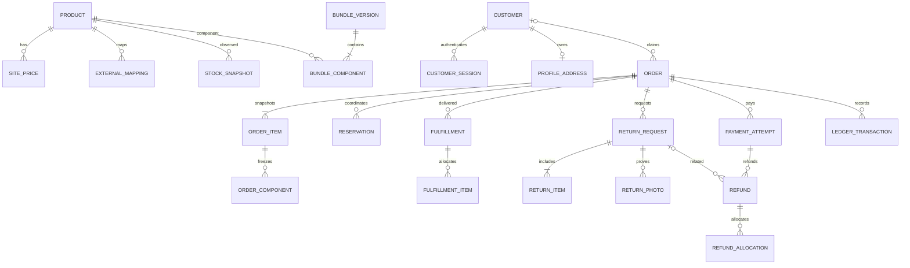
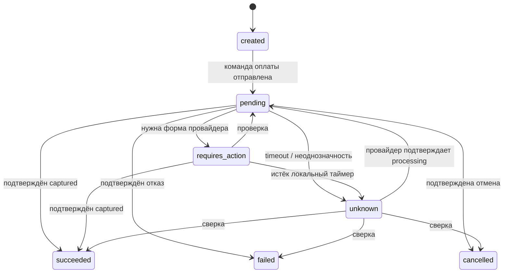

# PostgreSQL: модель данных и инварианты

Дата: 2026-10-06. **Проект схемы**, миграции и production DB не созданы. Единственный владелец схемы — Alembic в `packages/database`; SQLAlchemy models используются API и worker. Supabase PostgreSQL — возможный hosting, не второй schema/auth owner.

Связанные правила: BR-01–03 (владельцы/каналы/money), BR-05–08 (identity), BR-10–18 (stock/bundles/states), BR-20–23 (возвраты). Конкретные колонки ниже — инженерное предложение, не дополнительные бизнес-требования.

## 1. Общие соглашения

- PK — UUID; timestamps — `timestamptz`, UTC; `created_at` неизменен; `version bigint` для optimistic concurrency.
- Деньги: `bigint` minor units + `currency char(3)`, для MVP RUB/копейки. Расчёты ставок — Python Decimal; float запрещён. JSON money.amount — строка integer во избежание JS precision loss. Количества SKU — positive integer; Decimal quantity вводится лишь при новом согласованном типе товара.
- Ставки, стоимость закупки и комиссии имеют источник/дату/версию. Нет default рыночной маржи или захардкоженной себестоимости. FX/conversion вне MVP.
- Provider identifiers — строки, не локальный PK. Уникальность с provider/account/entity_type/channel; payment ID, posting number, seller SKU, offer ID, product ID — разные пространства.
- Деактивация товара вместо удаления исторических order snapshots. Retention/PII erasure согласовать до production; immutable финансовые факты не удаляются произвольно.

## 2. Логическая модель

## 3. Таблицы

| Группа | Таблицы и существенные поля | Ограничения |
|---|---|---|
| Каталог | `products(id, sku, type, title, description, active, version)`, `categories`, `product_categories`, `product_media`, `product_attributes`, `product_seo`, `collections`, `collection_items`, `product_relations` | unique SKU; категории из согласованного каталога; подборки CAT-04/«С этим сочетается» CAT-05 — управляемые связи, финальные поля открыты |
| Цены сайта | `site_prices(product_id, amount_minor, currency, valid_from, valid_to, changed_by)`, `price_changes` | Один текущий диапазон; изменение admin атомарно; глубина истории CAT/ADM открыта |
| Себестоимость | `product_costs(product_id, amount_minor, currency, valid_from, valid_to, source, changed_by)` | Ручная себестоимость ADM-05/BR-09; доступ только admin/разрешённой аналитике; точность исторических расчётов зависит от согласованных входов |
| Наборы | `bundles(product_id)`, `bundle_versions(id, bundle_id, version, active)`, `bundle_components(bundle_version_id, component_product_id, quantity)` | unique component/version, qty > 0; циклы/вложенные наборы запрещены как предложение MVP |
| External mapping | `external_mappings(provider, account_ref, channel, entity_type, local_id, external_id)` | unique external tuple; account_ref — внутренний ID, без credentials |
| Наличие | `stock_snapshots(product_id, provider, model, warehouse_ref, observed_at, available_qty, reserved_qty, freshness_state, raw_ref, semantics_version)` | Не смешивать FBO и FBS; поле reserved nullable если контракт его не даёт |
| Identity | `customers(phone_normalized, verified_at)`, `profile_addresses(customer_id, encrypted_payload)`, `sms_challenges(code_hash, expires_at, attempts, consumed_at)`, `customer_sessions(token_hash, expires_at, revoked_at)` | unique normalized phone, unique address/customer в предложенной модели ACC-02; объем адреса требует уточнения PRODUCT/MVP_SCOPE; plaintext SMS code не хранить |
| Admin | `admin_users(email_normalized, password_hash, active)`, `admin_sessions(token_hash, expires_at, revoked_at)` | Одна разрешённая admin identity; отдельные cookies/session tables |
| Гость и корзина | `guest_sessions(token_hash, expires_at)`, `carts(owner_type, owner_id, version)`, `cart_items(product_id, quantity)`, `checkout_quotes` | Один SKU/строка корзины; quote expiry + hash/version server calculation |
| Заказ | `orders(number, channel, customer_id?, guest_session_id?, lifecycle_state, attention_required, currency, subtotal_minor, discount_minor, delivery_minor, total_minor, address_snapshot, version)` | unique number; channel site/ozon_marketplace; исторические адрес и цены отделены от profile |
| Снимок позиции | `order_items(order_id, product_id?, sku_snapshot, title_snapshot, quantity, unit_list_minor, gross_minor, discount_minor, net_minor, bundle_version_id?)` | gross − discount = net; net ≥ 0; order total = sum(net) + delivery |
| Снимок компонентов | `order_components(order_item_id, component_sku_snapshot, quantity, allocated_gross_minor, allocated_discount_minor, allocated_net_minor, provider_mapping_snapshot)` | Независим от будущей редакции BOM/маппинга; суммы = суммы parent line |
| Резерв сайта | `reservations(order_id, product_id, warehouse_ref?, quantity, state, expires_at, provider_reflected_at?, reflection_snapshot_id?)` | active/released/reflected/expired; local only; нельзя автоматически restock FBO при refund |
| Оплата | `payment_attempts(order_id, attempt_number, state, requested_minor, captured_minor, currency, external_payment_id?, operation_id, verified_at?)` | unique order/attempt; captured только после verification; новый attempt запрещён пока предыдущий unknown/pending |
| Исполнение | `fulfillments(order_id, provider, external_posting_id?, state, provider_state, provider_updated_at?, verified_at?)`, `fulfillment_items(fulfillment_id, order_item_id, component_id?, quantity)` | Не предполагает 1 order = 1 shipment; суммарно отгружено ≤ заказано |
| Возврат товара | `return_requests(order_id, state, customer_reason, decision_reason?, decided_by?, decided_at?)`, `return_items(order_item_id, component_id?, quantity, requested_minor)`, `return_photos(object_key, scan_state, uploader_ref)` | rejected требует nonblank decision_reason; фото private; доступ по заказу/сессии |
| Возврат денег | `refunds(payment_attempt_id, return_request_id?, state, amount_minor, currency, external_refund_id?, operation_id, verified_at?)`, `refund_allocations(refund_id, order_item_id, component_id?, quantity?, amount_minor, kind)` | qty/amount bounds под row lock; kind goods/delivery; сумма allocations = refund amount |
| Финансы | `ledger_transactions(order_id, kind, provider_fact_key, occurred_at, currency)`, `ledger_entries(transaction_id, account_code, debit_minor, credit_minor)` | Уникальность provider fact; сумма debit = credit/transaction/currency; append-only |
| Интеграция | `operations(kind, aggregate_id, idempotency_key, request_hash, state, attempts, next_attempt_at, external_ref?, last_error_class)`, `outbox_events`, `inbox_events` | Подробнее ниже; raw payload private/limited retention |
| Аудит/события | `audit_log(actor_type, actor_id, action, entity_ref, change_summary, trace_id)`, `business_events(schema_version, event_name, channel, entity_ref, occurred_at)` | Append-only; PII minimization; аналитика не источник финансовых фактов |

Точный выбор CHECK versus PostgreSQL enum фиксируется миграцией. Для изменяющегося provider state хранить raw string и mapping version; raw string не становится разрешённым локальным состоянием.

## 4. Состояния

Это state machine payment attempt. `created` также может перейти в `failed` при локальной валидации до внешнего side effect. Локальный таймер не может отменить уже выполненный provider payment. Разрешены подтверждённые переходы из `requires_action` в `failed`/`cancelled`; диаграмма показывает основной путь.

| Объект | Допустимые переходы и guards |
|---|---|
| Order | placed → cancel_requested → cancelled только после подтверждённой отмены исполнения; placed/cancel_requested → completed после полного подтверждённого delivery (если отмена отклонена). `attention_required` — флаг, не перезапись lifecycle. Отказ отмены снимает cancel_requested по verification |
| Fulfillment | not_submitted → submission_pending → accepted → packing → shipped → ready_for_pickup → delivered; provider contract может пропускать промежуточные states. Отмена из допустимого provider state → cancelled; неоднозначность → unknown → результат сверки |
| Return | requested → under_review → approved/rejected; rejected требует reason. approved → closed только при завершении согласованного процесса товара/денег, rejected → closed как архивирование решения; reopen policy открыта |
| Refund | requested → pending → succeeded/failed/unknown; unknown → pending/succeeded/failed по сверке. Failed request можно повторить новой operation лишь после подтверждённого отсутствия refund |

Последовательность provider events может отличаться от локальной: version/time проверяются, terminal facts не откатываются устаревшим callback. Если timestamp/order событий ненадёжен, проверяется текущее состояние объекта. Неподдерживаемый provider state → сохранённое raw state + reconciliation, без предположения «доставлен».

## 5. Скидка набора и частичный возврат (BR-12–15, BR-20, BR-23)

Предложенный детерминированный алгоритм BR-15: разворачивать комплект в компонентные единицы, распределять итоговую товарную цену комплекта пропорционально снимкам обычных цен единиц методом наибольших остатков. Сначала floor точной Decimal доли в копейках, оставшиеся копейки — по убыванию дробного остатка; tie-break — component SKU и индекс единицы. Скидка единицы = исходная цена − net allocation, когда итог не выше суммы исходных цен. Нулевая база/all-zero цены и цена выше суммы компонентов требуют явной политики; не считать доплату отрицательной скидкой молча.

Пример **синтетический**, не бизнес-цены: компоненты 10000 и 20000 коп., цена комплекта 29000 коп. Итоговые доли net 9667 и 19333; скидки 333 и 667, total 29000. Аллокация заморожена в order snapshot и не пересчитывается по сегодняшним ценам. Для нескольких одинаковых единиц хранится стабильное распределение копеек по unit index, поэтому повторный частичный возврат не даёт накопленной ошибки.

`return_items.requested_minor` — заявленная сумма, не автоматически сумма refund. API server вычисляет допустимую сумму по снимку и истории возвратов. Lock payment + relevant allocations; проверить, что успешные refund + pending/unknown суммы + новый refund ≤ captured. Для количества аналогично учесть approved/in-progress/succeeded, чтобы две заявки не возвращали одну единицу дважды. Отклонённая заявка/подтверждённый failed refund освобождает только локальный лимит, не создаёт складское наличие.

Политика возврата отдельного компонента набора, доставка/комиссии и момент реального движения товара — открыты (RET-03). Алгоритм позволяет реализовать согласованную политику, но не принимает её за заказчика.

## 6. Reservation и конкурентность

Checkout получает row locks компонентов по стабильному порядку, агрегирует повторяющиеся SKU, проверяет freshness и quote. Для локального policy available используется provider available из snapshot минус только ещё не отражённые локальные reservations. Если available уже исключает provider reserved, reserved повторно не вычитается. Отражение доказывается внешним order reference + snapshot watermark по контракту; без такой связи точная доступность неизвестна.

Expiry worker освобождает локальную reservation, когда подтверждено, что operation не создала внешний заказ/оплату. Для unknown TTL запускает сверку; слепое expiry может привести к двойной продаже. Accepted provider operation помечает local reservation reflected/released по выбранной семантике, не создаёт второй долгосрочный резерв. Успешный refund также не является доказательством возврата товара на склад.

## 7. Transactional outbox / inbox

`outbox_events`: `id`, `aggregate_type/id`, `event_type`, `schema_version`, `payload`, `created_at`, `available_at`, `lease_until`, `attempts`, `published_at?`, `processed_at?`, `last_error_class`. Бизнес mutation и событие пишутся одним PG commit. Redis notification — подсказка; dispatcher сканирует PG (`FOR UPDATE SKIP LOCKED`) и reclaim истёкших leases. `published_at` не означает успешное выполнение operation.

`inbox_events`: `provider`, `account_ref`, `event_id`, `payload_hash`, `received_at`, `signature_verified`, `status`, `processed_at`, `raw_payload_ref?`, `provider_entity_ref`. Unique provider/account/event_id, если ID гарантирован; иначе документированная комбинация entity/version/hash. Одинаковый ID с другим hash — конфликт безопасности/контракта, не тихая замена.

Webhook отвечает успешным receipt только после durable commit проверенного события. Применение business state + inbox processed + ledger fact + follow-up outbox атомарно. At-least-once delivery допустима; exactly-once внешних side effects не обещается. Idempotency operation и verification обеспечивают отсутствие повторного локального факта.

`operations`: unique `(scope, idempotency_key)` + hash канонического request; same key/same request возвращает существующий результат, same key/different request — conflict. При timeout хранить unknown и внешнюю reference/ключ; retry создания разрешён только при подтверждённой idempotency provider или доказанном отсутствии предыдущего результата. Dead-letter — операционное состояние с аудитом, а не удаление финансового события.

## 8. Финансовый журнал

Payment captured и refund succeeded дают отдельные immutable ledger transactions после проверки, с уникальным ключом provider fact. Базовые технические accounts: provider clearing, sales liability/receivable и refund liability; окончательный бухгалтерский chart/recognition должен быть согласован специалистом. Это операционный subledger, не готовый налоговый/бухгалтерский учёт.

Fees, delivery charges и settlement — отдельные факты/операции с channel/source/date, если контракт их даёт. Не считать сумму заказа равной payout. Ошибка исправляется reversal/adjustment transaction со ссылкой на исходную; исходную entry не редактировать. Периодическая сверка сравнивает суммы, currencies, external refs и states; discrepancy хранится и требует разрешения.

## 9. Индексы, миграции и проверки

Предложенные индексы: active catalog/category; orders(customer_id, created_at), channel/external mapping; operations(state, next_attempt_at), outbox(available_at) partial unprocessed, inbox(status, received_at); reservations(product_id, state), expiry; returns(state, created_at), fulfillments(provider, external_posting_id). Телефон/email — unique normalized lookup, объём PII минимален.

Миграции Alembic проходят review и тест на чистой DB/upgrade предыдущей версии; destructive migrations требуют отдельного решения и backup. Критические CHECK/unique constraints, row-lock concurrency и outbox crash recovery проверяются интеграционными тестами PG. Fixtures synthetic; provider golden fixtures редактируются от PII/секретов. Все схемы должны быть уточнены после ARCH-G1–G4, а не автоматически реализованы как утверждённый контракт.
