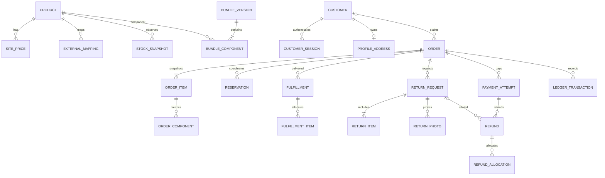
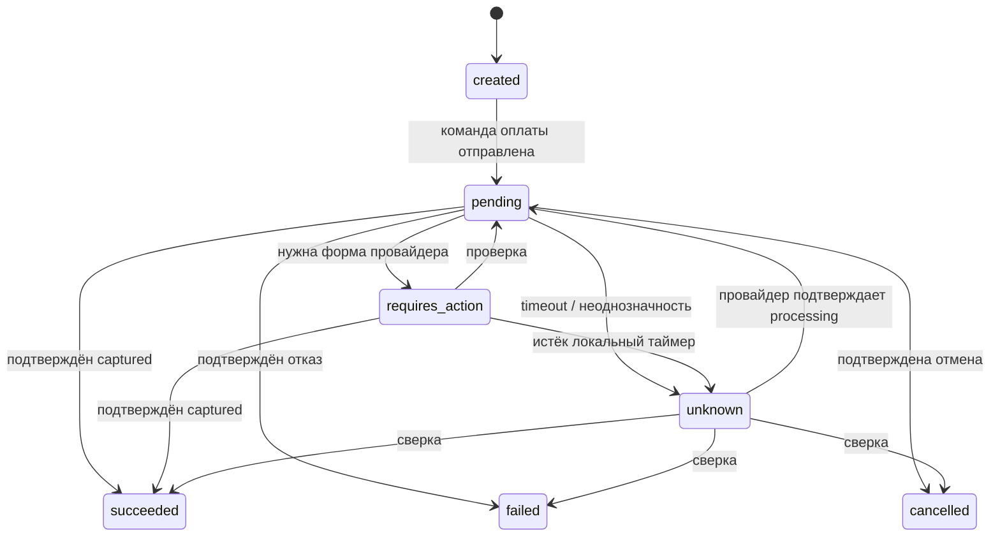

# PostgreSQL: модель данных и инварианты

База: 2026-10-06; уточнение: 2026-10-07. DDL/models/migrations 0001…0003 существуют на HEAD `0c8697a5102e6b9ff56e95889f319d8906f09d81`; actual PostgreSQL acceptance фиксируется отдельным отчётом. BA-SCOPE-01, BA-AUTH-01/ADR-014, BR-27 и S1-02…05 определяют активный этап. Единственный owner моделей/миграций — packages/database (Python SQLAlchemy/Alembic); Supabase только возможный PG hosting.

## Дополнение к admin persistence

0003 содержит `admin_users`, `admin_sessions`, `admin_permissions`, `audit_log`; это уже существующая additive migration, не новая auth система. `admin_permissions(admin_user_id, permission)` имеет composite PK и CHECK в `catalog.read/catalog.write/drafts.read`. Bootstrap берёт PG transaction/advisory lock, проверяет отсутствие другого owner и создаёт hash пользователя/permissions/audit одним commit. Дополнительный owner отвергается; reset того же owner заменяет Argon2id hash, отзывает все live sessions и аудируется без credentials. Сессия содержит random-token hash, owner FK, expiry/revocation; plaintext password/token не хранится. Все session/auth/permissions guards проверяются настоящими PG тестами. При обнаружении необходимых недостающих ограничений добавляется новая Alembic migration после DB/API review, существующая выпущенная миграция не переписывается.

Readonly Seller/Performance staging/snapshot таблицы допускаются только после отдельного documented contract review; они принадлежат тому же Alembic owner и не создают commercial order/payment/fulfillment/customer tables. Site price не копируется автоматически из marketplace price; provider observation/version/time хранится отдельно. Требования к идентичности/ошибкам описаны в плане завершения и OZON_INTEGRATION, а не определяются импортом произвольно.

## Этап 1: минимальные таблицы и migrations

Соглашения: UUID PK, UTC timestamptz, version bigint; positive integer quantity в диапазоне1…2147483647, включая total_quantity; RUB minor units bigint с checked overflow при Python расчёте. HTTP передаёт integer money строкой. Decimal для возможных коэффициентов, float запрещён. Предлагаемый demo допускает только положительные site prices; политика бесплатных/нулевых цен BR-09 не утверждается и потребует отдельного change до её реализации.

| Migration (предложенный файл) | Таблицы / поля | Ограничения и ownership |
| --- | --- | --- |
| 0001_catalog.py | products(id, sku, slug, type, title, description, active, version, attributes_json, seo_json); categories(id, slug, title, sort_order); product_categories; collections/collection_items; product_relations; site_prices(product_id PK, amount_minor, currency, version, updated_at); bundle_versions(id, product_id, number, created_at); bundle_components(version_id, component_product_id, quantity); products.current_bundle_version_id nullable; product_media(id, product_id, storage_key, media_type, scan_state, position, alt_text, metadata_json) | SKU/slug unique; CHECK type single/bundle; site_price >0/currency RUB; version растёт при mutation. Категории CAT-01, «Все товары» navigation, не SKU type. BOM после создания immutable; current version FK принадлежит product. Один component/version, qty>0. Запрет nested bundle — предложенная BR-12 validation, не новая утверждённая политика. Server storage_key unique; scan_state quarantined/clean/rejected; только clean публичны |
| 0002_guest_drafts.py | guest_sessions(id, token_hash, created_at, expires_at, revoked_at); carts(id, guest_session_id, version, updated_at); cart_items(cart_id, product_id, quantity); draft_quotes(id, guest_session_id, cart_id, cart_version, state, currency, goods_total_minor, delivery_minor nullable, payable_total_minor nullable, expires_at, consumed_by_draft_id nullable, snapshot_json, catalog_signature); checkout_drafts(id, guest_session_id, quote_id, state, channel, currency, goods_total_minor, delivery_minor nullable, payable_total_minor nullable, contact_snapshot, address_snapshot, created_at); draft_items(id, draft_id, position, product_id, sku_snapshot, title_snapshot, quantity, unit_price_minor, line_total_minor, bundle_version_id nullable); draft_components(id, draft_item_id, component_product_id, sku_snapshot, title_snapshot, quantity_per_bundle, total_quantity, base_unit_price_minor); idempotency_records(id, principal_id, operation, key_hash, request_hash, draft_id, response_status, created_at) | Хранить hash token/key; один cart/session, product/cart, draft/quote; qty>0; unique(principal_id,operation,key_hash). draft_id NOT NULL — заранее выделенный UUID, FK checkout_drafts DEFERRABLE INITIALLY DEFERRED; response_status NOT NULL CHECK201. FKs согласованы по owner: unique(id,guest_session_id) на carts/quotes/drafts; composite quote→cart и draft→quote FKs включают guest_session_id; idempotency(principal_id,draft_id)→draft(guest_session_id,id) deferred FK. draft.state CHECK saved; channel CHECK site; без customer_id dependency. quote.state valid/consumed. delivery_minor IS NULL AND payable_total_minor IS NULL для этапа 1; goods_total≥0. item total=unit_price×quantity>0; unique draft/position и parent/component SKU; quantities positive |
| 0003_admin_access.py (существует; auth flow BA-AUTH-01/ADR-014) | admin_users(id, email_normalized, password_hash, active); admin_sessions(id, admin_user_id, token_hash, expires_at, revoked_at); admin_permissions(admin_user_id, permission); audit_log(id, actor_type, actor_id, action, entity_type, entity_id, change_summary, trace_id, created_at) | Один permitted owner, без public signup/Supabase Auth. Scope/tables/cookie отделены от guest. Audit append-only без contact/password/token snapshots; Argon2id hash и session token hash; bootstrap/reset под PG lock |

Названия таблиц отделяют заявки от коммерческих orders. Для 0001–0003 не нужны payments/fulfillments/refunds/reservations/customer/address/SMS/external mappings/ledger/inbox/outbox/worker. product_costs/history/variants — будущие уточнения, это не отмена коммерческих ADM-05/08. Изменяемые site_prices и audit достаточны для текущей ручной цены; draft snapshot не зависит от UI истории.

Migration `0004_catalog_authoring` additively adds `site_prices.original_amount_minor`; existing prices stay valid with NULL. The catalog authoring contract stores admin characteristics in `products.attributes_json` and selected CAT-05 combinations in the existing `product_relations` table.

### Структура расчёта и снимка

snapshot_json — проверяемая версионируемая структура items/components DraftQuote из API, а не произвольный клиентский JSON. catalog_signature включает version/active верхних товаров, version/value/currency site_price, текущий BOM ID, а также SKU/title/active/type/version/value/currency каждого компонента. Изменение BOM при прежнем goods_total тоже отменяет прежнее подтверждение. Товары/компоненты должны оставаться active с допустимыми ценами сайта при сохранении; это проверка демонстрационного каталога, не наличия на складе.

draft_items сохраняют значения верхних строк и BOM. draft_components сохраняют quantity_per_bundle, total_quantity = количество комплектов × quantity_per_bundle, базовые цены компонентов. Они не прибавляются повторно к goods_total; базовая цена не является net allocation, оплаченной долей или лимитом refund. Перед добавлением распределения net для этапа 2 требуется согласование BR-15; сейчас оно не заполняется нулём или догадкой.

goods_total_minor = sum(draft_items.line_total_minor), валюта RUB. Неизвестная доставка — null, никогда не 0; payable_total=null. Application service в одной транзакции проверяет межстрочные суммы/ownership/умножение; это доказывают содержательные PG tests. CHECK не должен ошибочно ссылаться на другую строку. CHECK/unique/FK защищают типы, связи и гонки повтора. Saved result читается из снимка, без динамического join сегодняшних цен/каталога.

### Транзакция и конкурентность

1. Канонически нормализовать проверенный command (quote_id, contact/address с едиными правилами null), вычислить request_hash; scope = guest principal + create_checkout_draft. Действующую сессию проверить до replay.
2. Заранее выделить draft UUID и записать idempotency row с draft_id этим UUID и response_status=201 в той же транзакции. Deferred FK требует наличие actual saved draft до commit. Конфликт unique ждёт завершения первой транзакции: одинаковый request_hash возвращает прежний draft/status после owner check до expiry guard; другой hash →409 IDEMPOTENCY_CONFLICT. Отдельного committed processing placeholder нет.
3. Заблокировать cart, quote и каталог в стабильном порядке product ID, одинаковом с admin mutations. Проверить guest owner, cart_version, valid/unexpired quote и signature. Блокировки включают указатель текущего BOM, price rows и компоненты: admin update сериализуется до проверки либо после commit снимка.
4. Скопировать immutable snapshots/contact/address в draft/items/components; установить quote consumed/consumed_by; завершить запись всех сущностей одним commit. Placeholder не может закоммититься: deferred FK отвергает отсутствие draft. Новый key для consumed quote →409 QUOTE_USED, без новой заявки. Validation failure откатывает все записи; после временного сбоя БД можно повторить тот же body/key, изменение подтверждённых данных требует нового key.
5. Сбой до commit не создаёт заявки; retry выполняет команду. Потеря ответа после commit возвращает один прежний результат. Cart автоматически не очищается и остаётся редактируемым; намеренная новая заявка требует fresh quote/new key.

Внешних эффектов нет, поэтому local DB error не создаёт provider unknown/payment state. GET result повторяется с прежним cookie/ID. Deadlock/serialization retry ограничен, сохраняет идентичность команды; исчерпание попыток →503 STORAGE_TEMPORARILY_UNAVAILABLE, тот же key можно повторить.

### Сроки, защита и миграции

Техническая demo рекомендация: guest expiry7 дней, quote expiry15 минут, параметры явно в config/DTO; production retention не утверждена. Expiry/revocation закрывают доступ. Recovery по телефону/ID и auto-claim будущего SMS отсутствуют. Физическое удаление drafts/idempotency отложено до retention policy; demo reset только изолированной synthetic DB, не финансовых фактов. У immutable заявки нет PATCH/DELETE endpoint; repository не предоставляет их обход SQL update. Деактивация product сохраняет snapshots, hard-delete связанного каталога запрещён.

Индексы: products(active/category relation), checkout_drafts(created_at,id), checkout_drafts(guest_session_id,created_at), guest token_hash unique, cart owner unique, quote(cart_id,expires_at), idempotency unique scope. Admin list фильтрует saved/date с непрозрачным cursor; публичного поиска по телефону нет. Только после validation/audit media меняется quarantined→clean; bytes хранятся отдельно от PG. Additive migrations выполняются отдельной явной задачей один раз, без startup create_all и второй системы ORM migrations. Пустая БД и переходы 0001→0002→0003 проверяются в actual PG.

## Этап 2: сохранённая коммерческая модель (не bootstrap DDL)

Разделы ниже сохраняют проект реальных покупок после бизнес/provider/release gates. Их order/quotes/customer/ledger schema отделена от draft таблиц этапа 1. Если promotion будет согласован, он создаёт новый проверенный commercial order со ссылкой на draft; старые snapshots/state не переписываются, автоматических paid/submission нет.

## 1. Общие соглашения

- PK — UUID; timestamps — `timestamptz`, UTC; `created_at` неизменен; `version bigint` для optimistic concurrency.
- Деньги: `bigint` minor units + `currency char(3)`, для MVP RUB/копейки. Расчёты ставок — Python Decimal; float запрещён. JSON money.amount — строка integer во избежание JS precision loss. Количества SKU — positive integer; Decimal quantity вводится лишь при новом согласованном типе товара.
- Ставки, стоимость закупки и комиссии имеют источник/дату/версию. Нет default рыночной маржи или захардкоженной себестоимости. FX/conversion вне MVP.
- Provider identifiers — строки, не локальный PK. Уникальность с provider/account/entity_type/channel; payment ID, posting number, seller SKU, offer ID, product ID — разные пространства.
- Деактивация товара вместо удаления исторических order snapshots. Retention/PII erasure согласовать до production; immutable финансовые факты не удаляются произвольно.

## 2. Логическая модель

## 3. Таблицы

| Группа | Таблицы и существенные поля | Ограничения |
|---|---|---|
| Каталог | `products(id, sku, type, title, description, active, version)`, `categories`, `product_categories`, `product_media`, `product_attributes`, `product_seo`, `collections`, `collection_items`, `product_relations` | unique SKU; категории из согласованного каталога; `product_relations` хранит симметричную группу вариантов CAT-05 (рекомендации «С этим сочетается» требуют отдельной модели) |
| Цены сайта | `site_prices(product_id, amount_minor, original_amount_minor nullable, currency, version, updated_at)` | Один текущий диапазон; изменение admin атомарно; `original_amount_minor` положителен и не ниже текущей цены; глубина истории CAT/ADM открыта |
| Себестоимость | `product_costs(product_id, amount_minor, currency, valid_from, valid_to, source, changed_by)` | Ручная себестоимость ADM-05/BR-09; доступ только admin/разрешённой аналитике; точность исторических расчётов зависит от согласованных входов |
| Наборы | `bundles(product_id)`, `bundle_versions(id, bundle_id, version, active)`, `bundle_components(bundle_version_id, component_product_id, quantity)` | unique component/version, qty > 0; циклы/вложенные наборы запрещены как предложение MVP |
| External mapping | `external_mappings(provider, account_ref, channel, entity_type, local_id, external_id)` | unique external tuple; account_ref — внутренний ID, без credentials |
| Наличие | `stock_snapshots(product_id, provider, model, warehouse_ref, observed_at, available_qty, reserved_qty, freshness_state, raw_ref, semantics_version)` | Не смешивать FBO и FBS; поле reserved nullable если контракт его не даёт |
| Identity | `customers(phone_normalized, verified_at)`, `profile_addresses(customer_id, encrypted_payload)`, `sms_challenges(code_hash, expires_at, attempts, consumed_at)`, `customer_sessions(token_hash, expires_at, revoked_at)` | unique normalized phone, unique address/customer в предложенной модели ACC-02; объем адреса требует уточнения PRODUCT/MVP_SCOPE; plaintext SMS code не хранить |
| Admin | `admin_users(email_normalized, password_hash, active)`, `admin_sessions(token_hash, expires_at, revoked_at)` | Одна разрешённая admin identity; отдельные cookies/session tables |
| Гость и корзина | `guest_sessions(token_hash, expires_at)`, `carts(owner_type, owner_id, version)`, `cart_items(product_id, quantity)`, `checkout_quotes` | Один SKU/строка корзины; quote expiry + hash/version server calculation |
| Заказ | `orders(number, channel, customer_id?, guest_session_id?, lifecycle_state, attention_required, currency, subtotal_minor, discount_minor, delivery_minor, total_minor, address_snapshot, version)` | unique number; channel site/ozon_marketplace; исторические адрес и цены отделены от profile |
| Снимок позиции | `order_items(order_id, product_id?, sku_snapshot, title_snapshot, quantity, unit_list_minor, gross_minor, discount_minor, net_minor, bundle_version_id?)` | gross − discount = net; net ≥ 0; order total = sum(net) + delivery |
| Снимок компонентов | `order_components(order_item_id, component_sku_snapshot, quantity, allocated_gross_minor, allocated_discount_minor, allocated_net_minor, provider_mapping_snapshot)` | Независим от будущей редакции BOM/маппинга; суммы = суммы parent line |
| Резерв сайта | `reservations(order_id, product_id, warehouse_ref?, quantity, state, expires_at, provider_reflected_at?, reflection_snapshot_id?)` | active/released/reflected/expired; local only; нельзя автоматически restock FBO при refund |
| Оплата | `payment_attempts(order_id, attempt_number, state, requested_minor, captured_minor, currency, external_payment_id?, operation_id, verified_at?)` | unique order/attempt; captured только после verification; новый attempt запрещён пока предыдущий unknown/pending |
| Исполнение | `fulfillments(order_id, provider, external_posting_id?, state, provider_state, provider_updated_at?, verified_at?)`, `fulfillment_items(fulfillment_id, order_item_id, component_id?, quantity)` | Не предполагает 1 order = 1 shipment; суммарно отгружено ≤ заказано |
| Возврат товара | `return_requests(order_id, state, customer_reason, decision_reason?, decided_by?, decided_at?)`, `return_items(order_item_id, component_id?, quantity, requested_minor)`, `return_photos(object_key, scan_state, uploader_ref)` | rejected требует nonblank decision_reason; фото private; доступ по заказу/сессии |
| Возврат денег | `refunds(payment_attempt_id, return_request_id?, state, amount_minor, currency, external_refund_id?, operation_id, verified_at?)`, `refund_allocations(refund_id, order_item_id, component_id?, quantity?, amount_minor, kind)` | qty/amount bounds под row lock; kind goods/delivery; сумма allocations = refund amount |
| Финансы | `ledger_transactions(order_id, kind, provider_fact_key, occurred_at, currency)`, `ledger_entries(transaction_id, account_code, debit_minor, credit_minor)` | Уникальность provider fact; сумма debit = credit/transaction/currency; append-only |
| Интеграция | `operations(kind, aggregate_id, idempotency_key, request_hash, state, attempts, next_attempt_at, external_ref?, last_error_class)`, `outbox_events`, `inbox_events` | Подробнее ниже; raw payload private/limited retention |
| Аудит/события | `audit_log(actor_type, actor_id, action, entity_ref, change_summary, trace_id)`, `business_events(schema_version, event_name, channel, entity_ref, occurred_at)` | Append-only; PII minimization; аналитика не источник финансовых фактов |

Точный выбор CHECK versus PostgreSQL enum фиксируется миграцией. Для изменяющегося provider state хранить raw string и mapping version; raw string не становится разрешённым локальным состоянием.

## 4. Состояния

Это state machine payment attempt. `created` также может перейти в `failed` при локальной валидации до внешнего side effect. Локальный таймер не может отменить уже выполненный provider payment. Разрешены подтверждённые переходы из `requires_action` в `failed`/`cancelled`; диаграмма показывает основной путь.

| Объект | Допустимые переходы и guards |
|---|---|
| Order | placed → cancel_requested → cancelled только после подтверждённой отмены исполнения; placed/cancel_requested → completed после полного подтверждённого delivery (если отмена отклонена). `attention_required` — флаг, не перезапись lifecycle. Отказ отмены снимает cancel_requested по verification |
| Fulfillment | not_submitted → submission_pending → accepted → packing → shipped → ready_for_pickup → delivered; provider contract может пропускать промежуточные states. Отмена из допустимого provider state → cancelled; неоднозначность → unknown → результат сверки |
| Return | requested → under_review → approved/rejected; rejected требует reason. approved → closed только при завершении согласованного процесса товара/денег, rejected → closed как архивирование решения; reopen policy открыта |
| Refund | requested → pending → succeeded/failed/unknown; unknown → pending/succeeded/failed по сверке. Failed request можно повторить новой operation лишь после подтверждённого отсутствия refund |

Последовательность provider events может отличаться от локальной: version/time проверяются, terminal facts не откатываются устаревшим callback. Если timestamp/order событий ненадёжен, проверяется текущее состояние объекта. Неподдерживаемый provider state → сохранённое raw state + reconciliation, без предположения «доставлен».

## 5. Скидка набора и частичный возврат (BR-12–15, BR-20, BR-23)

Предложенный детерминированный алгоритм BR-15: разворачивать комплект в компонентные единицы, распределять итоговую товарную цену комплекта пропорционально снимкам обычных цен единиц методом наибольших остатков. Сначала floor точной Decimal доли в копейках, оставшиеся копейки — по убыванию дробного остатка; tie-break — component SKU и индекс единицы. Скидка единицы = исходная цена − net allocation, когда итог не выше суммы исходных цен. Нулевая база/all-zero цены и цена выше суммы компонентов требуют явной политики; не считать доплату отрицательной скидкой молча.

Пример **синтетический**, не бизнес-цены: компоненты 10000 и 20000 коп., цена комплекта 29000 коп. Итоговые доли net 9667 и 19333; скидки 333 и 667, total 29000. Аллокация заморожена в order snapshot и не пересчитывается по сегодняшним ценам. Для нескольких одинаковых единиц хранится стабильное распределение копеек по unit index, поэтому повторный частичный возврат не даёт накопленной ошибки.

`return_items.requested_minor` — заявленная сумма, не автоматически сумма refund. API server вычисляет допустимую сумму по снимку и истории возвратов. Lock payment + relevant allocations; проверить, что успешные refund + pending/unknown суммы + новый refund ≤ captured. Для количества аналогично учесть approved/in-progress/succeeded, чтобы две заявки не возвращали одну единицу дважды. Отклонённая заявка/подтверждённый failed refund освобождает только локальный лимит, не создаёт складское наличие.

Политика возврата отдельного компонента набора, доставка/комиссии и момент реального движения товара — открыты (RET-03). Алгоритм позволяет реализовать согласованную политику, но не принимает её за заказчика.

## 6. Reservation и конкурентность

Checkout получает row locks компонентов по стабильному порядку, агрегирует повторяющиеся SKU, проверяет freshness и quote. Для локального policy available используется provider available из snapshot минус только ещё не отражённые локальные reservations. Если available уже исключает provider reserved, reserved повторно не вычитается. Отражение доказывается внешним order reference + snapshot watermark по контракту; без такой связи точная доступность неизвестна.

Expiry worker освобождает локальную reservation, когда подтверждено, что operation не создала внешний заказ/оплату. Для unknown TTL запускает сверку; слепое expiry может привести к двойной продаже. Accepted provider operation помечает local reservation reflected/released по выбранной семантике, не создаёт второй долгосрочный резерв. Успешный refund также не является доказательством возврата товара на склад.

## 7. Transactional outbox / inbox

`outbox_events`: `id`, `aggregate_type/id`, `event_type`, `schema_version`, `payload`, `created_at`, `available_at`, `lease_until`, `attempts`, `published_at?`, `processed_at?`, `last_error_class`. Бизнес mutation и событие пишутся одним PG commit. Redis notification — подсказка; dispatcher сканирует PG (`FOR UPDATE SKIP LOCKED`) и reclaim истёкших leases. `published_at` не означает успешное выполнение operation.

`inbox_events`: `provider`, `account_ref`, `event_id`, `payload_hash`, `received_at`, `signature_verified`, `status`, `processed_at`, `raw_payload_ref?`, `provider_entity_ref`. Unique provider/account/event_id, если ID гарантирован; иначе документированная комбинация entity/version/hash. Одинаковый ID с другим hash — конфликт безопасности/контракта, не тихая замена.

Webhook отвечает успешным receipt только после durable commit проверенного события. Применение business state + inbox processed + ledger fact + follow-up outbox атомарно. At-least-once delivery допустима; exactly-once внешних side effects не обещается. Idempotency operation и verification обеспечивают отсутствие повторного локального факта.

`operations`: unique `(scope, idempotency_key)` + hash канонического request; same key/same request возвращает существующий результат, same key/different request — conflict. При timeout хранить unknown и внешнюю reference/ключ; retry создания разрешён только при подтверждённой idempotency provider или доказанном отсутствии предыдущего результата. Dead-letter — операционное состояние с аудитом, а не удаление финансового события.

## 8. Финансовый журнал

Payment captured и refund succeeded дают отдельные immutable ledger transactions после проверки, с уникальным ключом provider fact. Базовые технические accounts: provider clearing, sales liability/receivable и refund liability; окончательный бухгалтерский chart/recognition должен быть согласован специалистом. Это операционный subledger, не готовый налоговый/бухгалтерский учёт.

Fees, delivery charges и settlement — отдельные факты/операции с channel/source/date, если контракт их даёт. Не считать сумму заказа равной payout. Ошибка исправляется reversal/adjustment transaction со ссылкой на исходную; исходную entry не редактировать. Периодическая сверка сравнивает суммы, currencies, external refs и states; discrepancy хранится и требует разрешения.

## 9. Индексы, миграции и проверки

Предложенные индексы: active catalog/category; orders(customer_id, created_at), channel/external mapping; operations(state, next_attempt_at), outbox(available_at) partial unprocessed, inbox(status, received_at); reservations(product_id, state), expiry; returns(state, created_at), fulfillments(provider, external_posting_id). Телефон/email — unique normalized lookup, объём PII минимален.

Миграции Alembic проходят review и тест на чистой DB/upgrade предыдущей версии; destructive migrations требуют отдельного решения и backup. Критические CHECK/unique constraints, row-lock concurrency и outbox crash recovery проверяются интеграционными тестами PG. Fixtures synthetic; provider golden fixtures редактируются от PII/секретов. Все схемы должны быть уточнены после ARCH-G1–G4, а не автоматически реализованы как утверждённый контракт.
