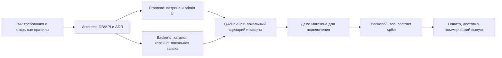

# Работа с одним источником истины

## Иерархия документов

`PRODUCT` описывает потребность; `MVP_SCOPE` — релиз; `BUSINESS_RULES` — поведение. `ARCHITECTURE`, `DATABASE`, `API`, `OZON_INTEGRATION` описывают технический проект. `DECISIONS` хранит статус выбора и объяснение. `QA`, `SECURITY`, `DEPLOYMENT` определяют доказательства готовности.

Иерархия не разрешает противоречия автоматически. Если правило и контракт расходятся, открыть документационный PR, указать оба пункта и заблокировать зависимый change. Переписка становится требованием только после документирования и согласования статуса.

## Последовательность первого этапа

По решению заказчика 2026-10-06 сначала готовится версия магазина для демонстрации и начала подключения Ozon. Реальные оплата/доставка и коммерческий выпуск — следующий этап. Точные границы и критерии находятся в [MVP_SCOPE.md](MVP_SCOPE.md).



Озоновские gates блокируют реальную покупку, fulfillment и денежные возвраты, но не сохранение локальной демонстрационной заявки в первом этапе. Демо показывает отсутствие оплаты и подтверждённой доставки; оно не доказывает доступ к API или одобрение подключения Ozon. Одна задача не пересекается по записи с другой: общие контракты сначала стабилизируются в Architect PR. Не запускать пять исполнителей на одну схему/API одновременно.

## Цикл задачи

1. Записать scope, ID требований, владельца, входные документы/commit и критерии готовности в issue.
2. Прочитать профиль и `AGENTS.md`; проверить, что зависимые ADR/gates разрешены.
3. Сначала изменить документацию при изменении поведения или контракта.
4. Создать branch, выполнить ограниченную задачу, приложить evidence проверки.
5. Reviewer проверяет соответствие требованиям, контракты и границы доступа. Автор исправляет дефекты.
6. Merge после обязательных checks; статус gates не повышается без доказательства.

Feature branch и PR применяются при реализации. Начальная загрузка этого пустого репозитория содержит только документацию и каркас.

## Статусы

- **подтверждено заказчиком** — продуктовая потребность из интервью/явного решения;
- **предложено** — рекомендация, пока не принято;
- **проверено источником** — факт из указанного файла/документа, с датой и ограничением применимости;
- **требует проверки** — внешняя возможность/правило, пока без подтверждения;
- **готово к реализации** — требования, контракты и gates конкретной задачи согласованы;
- **проверено реализацией** — приложены результаты работающей системы, не только mock.

## Шаблон задания агенту

```text
Профиль: <один из docs/agents>
Цель: <проверяемое изменение>
Документы и commit: <список>
Requirement IDs / BR: <список>
Разрешённые файлы: <границы>
Зависимости / gates: <разрешены или blocked>
Входной API/DB contract: <версия>
Критерии приёмки и проверки: <конкретные случаи>
Результат: PR + evidence + нерешённые вопросы
```

Не назначать «сделай весь магазин» без контрактов. Не переносить решение одного агента в документы как утверждённое решение заказчика.
